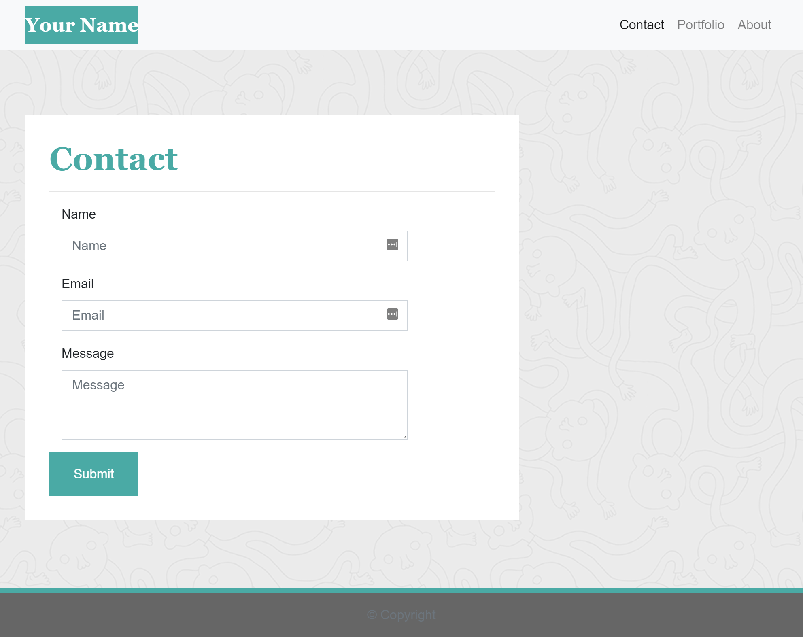
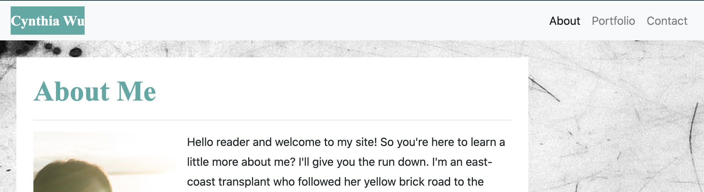
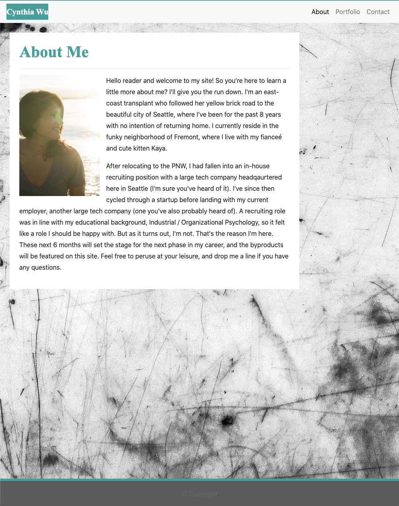
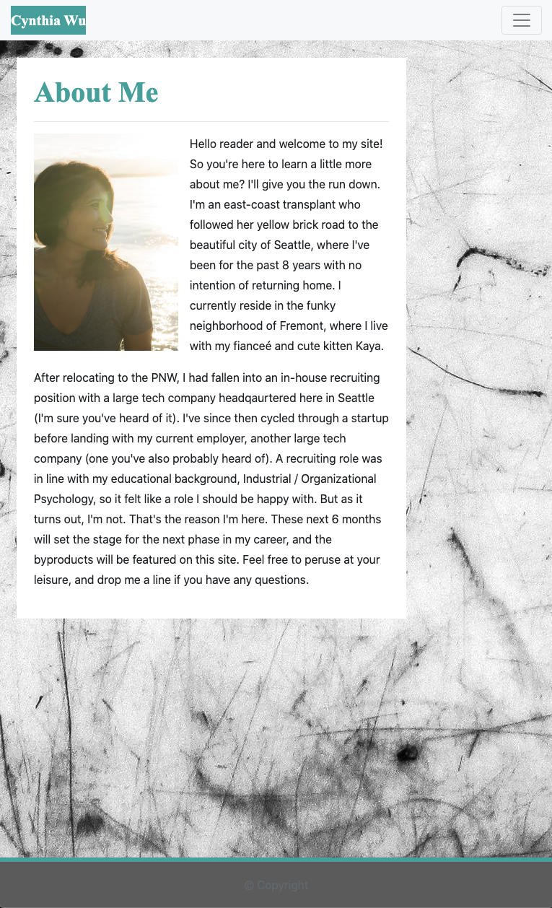
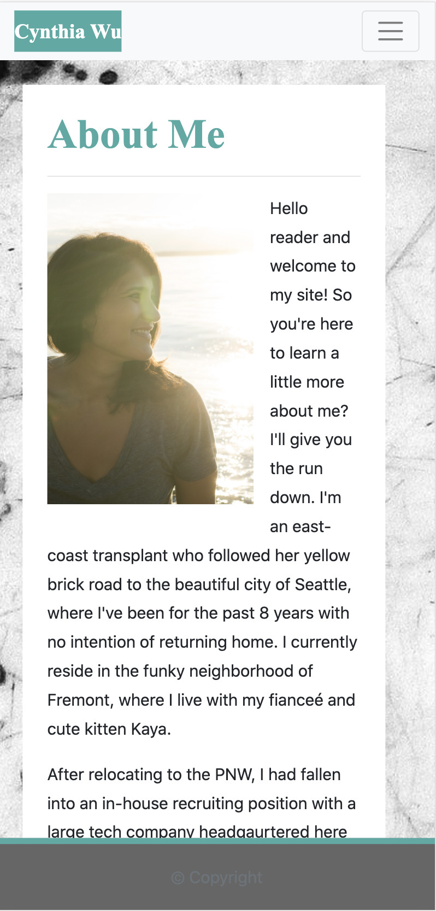
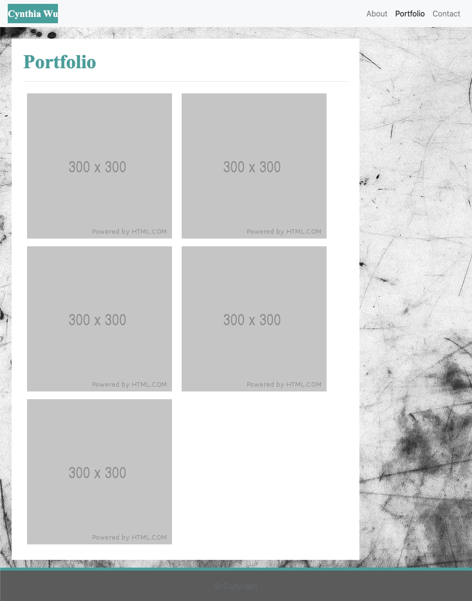
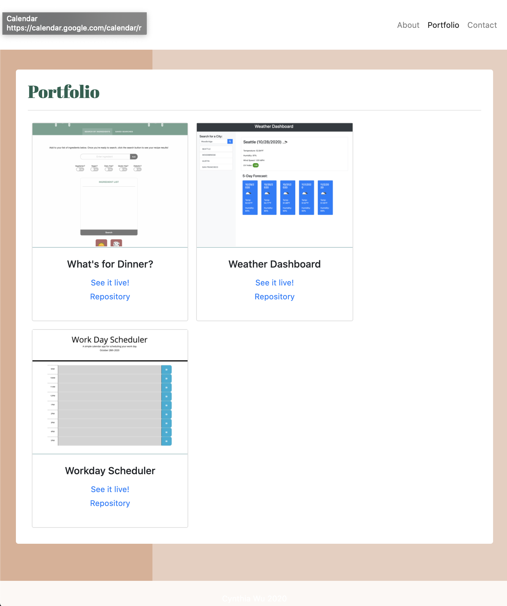
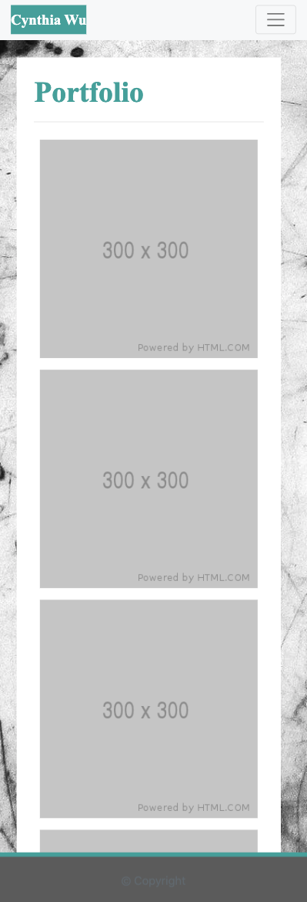
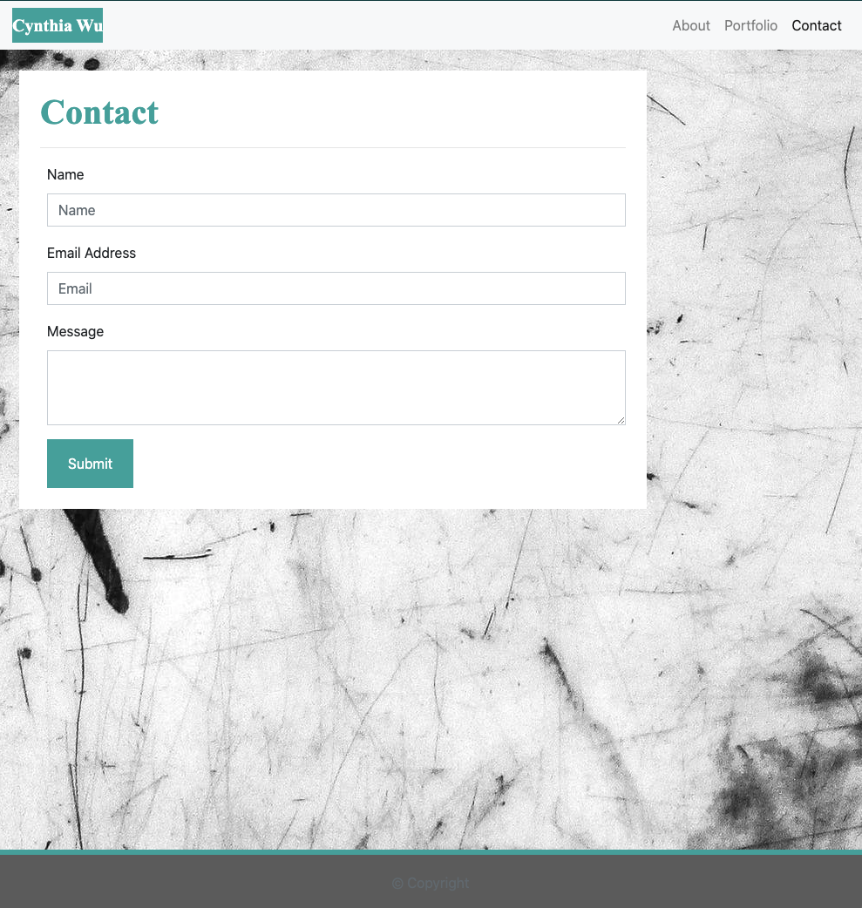
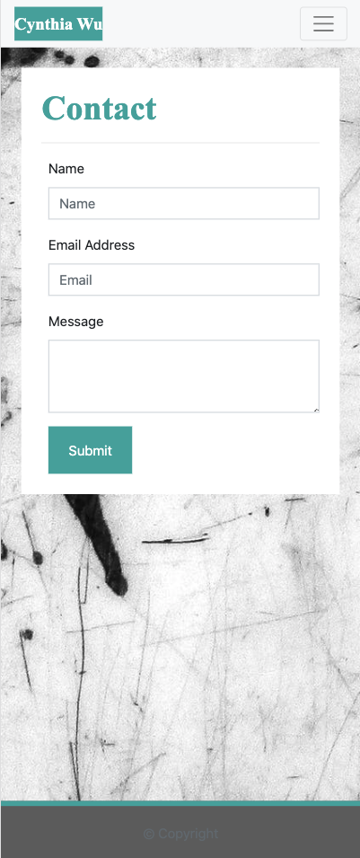

# HOMEWORK ASSIGNMENT 2: Responsive Portfolio with Bootsrap

Explore the [project page](https://github.com/cynthiwu/hw2-bootstrap-responsive)

View it live on [github-pages](https://cynthiwu.github.io/hw2-bootstrap-responsive/)

## Table of Contents
- [HOMEWORK ASSIGNMENT 2: Responsive Portfolio with Bootsrap](#homework-assignment-2-responsive-portfolio-with-bootsrap)
  - [Table of Contents](#table-of-contents)
  - [About The Project](#about-the-project)
    - [The Navbar](#the-navbar)
    - [The About Me Page](#the-about-me-page)
      - [About Me Page Resonsiveness](#about-me-page-resonsiveness)
        - [About Me - 992px](#about-me---992px)
        - [About Me - 768px](#about-me---768px)
        - [About Me - 400px](#about-me---400px)
    - [The Portfolio Page](#the-portfolio-page)
      - [Portfolio Page Resonsiveness](#portfolio-page-resonsiveness)
        - [Portfolio - 992px](#portfolio---992px)
        - [Portfolio - 768px](#portfolio---768px)
        - [Portfolio - 400px](#portfolio---400px)
    - [The Contact Page](#the-contact-page)
      - [Contact Page Resonsiveness](#contact-page-resonsiveness)
        - [Contact - 992px](#contact---992px)
        - [Contact - 768px](#contact---768px)
        - [Contact - 400px](#contact---400px)
    - [Additional Elements and Styling](#additional-elements-and-styling)
    - [Built With](#built-with)
  - [Roadmap](#roadmap)
  - [Contributing](#contributing)
  - [Contact](#contact)


## About The Project

The directive of this assignment was to create the initial framework of a mobile responsive portfolio. This framework was to include three HTML files and contain a navbar within a responsive layout. CSS was meant to be primarily constructed using Bootstrap (v4.5.2) with final interface closely replicating screenshots included in the assignment documentation. These screenshots represented the page layout of each file at three different breakpoints (i.e., 992px, 768px, and 400px). The 992px screenshots have been provided below to represent the starting point of this portfolio.

<div>



</div>


The approach to creating this project is outlined below by feature or portfolio page. 


### The Navbar

<br>



<br>

*  The Navbar was created using the existing code from Bootstrap's components. It includes the navbar.brand class, which allows my name (a.k.a brand) to appear top left, and navigation links to the right. 
*  The default version of this code pulled the nav links to the left hand side of the brand, which I overrode by including the Bootstrap ml-auto class in the nav link container. 
*  I utilized Bootstrap's fixed-top class to max the navbar expand full width across the screen. This caused issues 
*  The Navbar has responsivness built in, tranforming the nav links to a toggler menu at the 992px breakpoint.
*  The same block of code was used on each page, adjusting the inactive nav link to be that of the current page.

<br>


### The About Me Page

*  The About Me page was created by using Bootstrap's grid system. One container, row, and column was used for this (and all other) pages to allow for ease of styling. 
*  Responsiveness was created by utilizing three variable width column classes below (ex., col-xs-12).
*  Additional padding and margins were implemented mostly by using existing Bootstrap classes for these styles (per recommendation of instructor).

```
<main role="main" class="container mx-4 my-5">
  <section class="row">
      <div class="col-xs-12 col-sm-8 col-md-9 p-4 mr-5 about-me">
        <h2>About Me</h2>
        <hr>
        
        <p>Personal biographical content here.</p>
        <p>Personal biographical content here.</p>
      </div>
  </section> 
</main>
```
#### About Me Page Resonsiveness

Review the images below to view the page layout at three different breakpoints (i.e., 992px, 768px, and 400px).

##### About Me - 992px



##### About Me - 768px



##### About Me - 400px




### The Portfolio Page

*  The Portfolio page was created by using Bootstrap's grid system. One container, row, and column was used for this (and all other) pages to allow for ease of styling. 
*  Responsiveness was created by utilizing three variable width column classes below (ex., col-xs-9).
*  Additional padding and margins were implemented mostly by using existing Bootstrap classes for these styles (per recommendation of instructor).

#### Portfolio Page Resonsiveness

Review the images below to view the page layout at three different breakpoints (i.e., 992px, 768px, and 400px).

##### Portfolio - 992px



##### Portfolio - 768px



##### Portfolio - 400px



### The Contact Page

*  The Contact page was created by using Bootstrap's grid system. One container, row, and column was used for this (and all other) pages to allow for ease of styling. 
*  The contact form was created using existing Bootstrap framework, adjusting the input type for type of data collected.
*  Responsiveness was created by utilizing three variable width column classes below (ex., col-xs-9).
*  Additional padding and margins were implemented mostly by using existing Bootstrap classes for these styles (per recommendation of instructor).

#### Contact Page Resonsiveness

Review the images below to view the page layout at three different breakpoints (i.e., 992px, 768px, and 400px).

##### Contact - 992px



##### Contact - 768px


##### Contact - 400px




### Additional Elements and Styling

A fixed-bottom foorer was included to replicate the fotter in assignment images. Additional styling of all pages was accomplished with a separate CSS file. The major elements that were affected include the following:

* H1 font size, weight, and color, along with the background color. 
* Navbar styling
* H2 font size, weight, and color
* Column styling and backgorund
* Footer styling and border
* Contact form styling


### Built With

* This project was built using [Bootstrap](https://getbootstrap.com/).
* HTML code was validated using the [W3C Markup Validation Service](https://validator.w3.org/).


## Roadmap

* Future iterations will include a more responsive background image that is stored locally. Current image tiles when viewing on a mobile device. 


## Contributing

Contributions are what make the open source community such an amazing place to be learn, inspire, and create. Any contributions you make are **greatly appreciated**.

1. Fork the Project
2. Create your Feature Branch (`git checkout -b feature/AmazingFeature`)
3. Commit your Changes (`git commit -m 'Add some AmazingFeature'`)
4. Push to the Branch (`git push origin feature/AmazingFeature`)
5. Open a Pull Request


## Contact

Cynthia Wu - [@cynthia21wu](https://twitter.com/cynthia21wu) - cynthia21wu@gmail.com

Project Link: [https://github.com/cynthiwu/hw2-bootstrap-responsive](https://github.com/cynthiwu/hw2-bootstrap-responsive)
