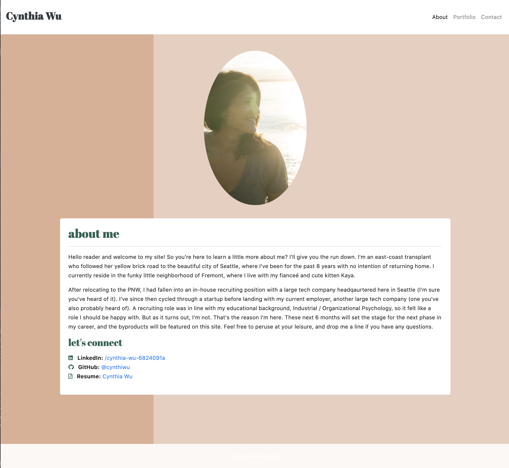
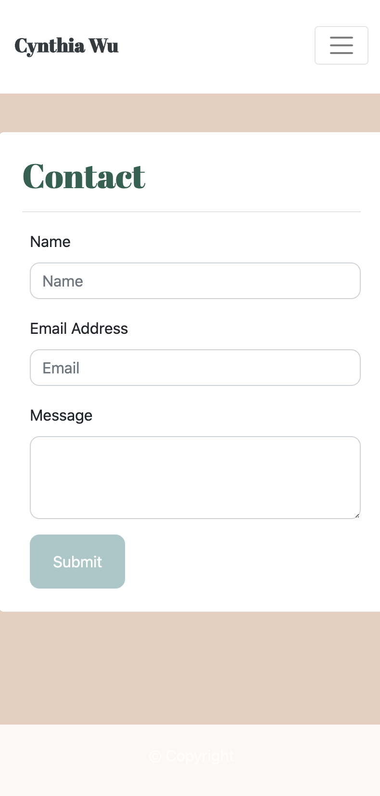

# My Portfolio

Explore the [project page](https://github.com/cynthiwu/my-portfolio)

View it live on [github-pages](https://cynthiwu.github.io/my-portfolio/)

## Table of Contents
- [About The Project](#about-the-project)
  - [The Navbar](#the-navbar)
  - [The About Me Page](#the-about-me-page)
      - [About Me Page Resonsiveness](#about-me-page-resonsiveness)
        - [About Me - 992px](#about-me---992px)
        - [About Me - 768px](#about-me---768px)
        - [About Me - 400px](#about-me---400px)
    - [The Portfolio Page](#the-portfolio-page)
      - [Portfolio Page Resonsiveness](#portfolio-page-resonsiveness)
        - [Portfolio - 992px](#portfolio---992px)
        - [Portfolio - 768px](#portfolio---768px)
        - [Portfolio - 400px](#portfolio---400px)
    - [The Contact Page](#the-contact-page)
      - [Contact Page Resonsiveness](#contact-page-resonsiveness)
        - [Contact - 992px](#contact---992px)
        - [Contact - 768px](#contact---768px)
        - [Contact - 400px](#contact---400px)
    - [Additional Elements and Styling](#additional-elements-and-styling)
    - [Built With](#built-with)
  - [Roadmap](#roadmap)
  - [Contributing](#contributing)
  - [Contact](#contact)

## About The Project

The purpose of this project was to create a working framework of a mobile responsive portfolio. This framework was created using three HTML files with styling primarily constructed using Bootstrap (v4.5.2). My primary focus was creating a responsive page layout three different breakpoints (i.e., 992px, 768px, and 400px). This portolio is no where near finsihed, but a good starting point to house my projects.

## Demo

Review the images below for a quick preview at different viewpoints.

### About Me - 992px

### Portfolio - 768px

### Contact - 400px

## Built With

* This project was built using [Bootstrap](https://getbootstrap.com/).
* HTML code was validated using the [W3C Markup Validation Service](https://validator.w3.org/).

## Roadmap

* I will be continuing to build off of this project, incorporating features I learn along the way. 

## Contact

Cynthia Wu - [@cynthia21wu](https://twitter.com/cynthia21wu) - cynthia21wu@gmail.com

